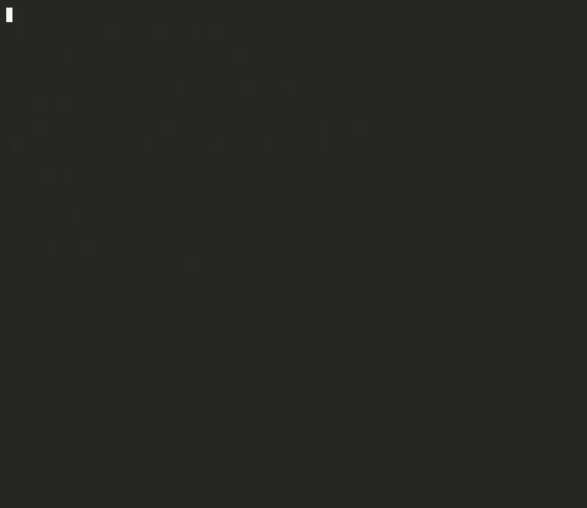

# iocflow

[](https://github.com/vinayvobbili/iocflow/actions/workflows/ci.yml)
[](https://pypi.org/project/iocflow/)
[](https://pypi.org/project/iocflow/)
[](https://github.com/vinayvobbili/iocflow/blob/main/LICENSE)

Pull **indicators of compromise** out of unstructured text — threat-intel
reports, advisories, emails, tickets — in one call. iocflow extracts IPs,
domains, URLs, filenames, file hashes, CVEs, MITRE ATT&CK technique IDs, threat
actors, and malware families, with the false-positive defenses you'd otherwise
write by hand: a Public Suffix List domain validator, benign-domain/IP
allowlists, hash de-duplication across MD5/SHA1/SHA256, and re-fanging of
defanged IOCs.

```python
from iocflow import extract

text = """
APT28 (a.k.a. Fancy Bear) staged Cobalt Strike from evil-domain[.]ru and
185.220.101.5, dropping install.ps1 (MD5 a1b2c3d4e5f6a1b2c3d4e5f6a1b2c3d4).
Exploited CVE-2021-44228 via T1190. Contact: ops@evil-domain[.]ru.
"""

entities = extract(text)
print(entities.summary())
# 1 IPs, 1 domains, 1 filenames, 1 hashes, 1 CVEs, 1 emails, 1 threat actors, 1 MITRE techniques

for ind in entities.iter_indicators():
    print(ind.kind, ind.value)
# ip 185.220.101.5
# domain evil-domain.ru
# ...
```

The defanged `evil-domain[.]ru` and `ops@evil-domain[.]ru` are re-fanged
automatically; `185.220.101.5` is kept while private/benign IPs are dropped.

## Install

```bash
pip install iocflow              # core — one dependency (tldextract)
pip install "iocflow[mitre]"     # + a ready-made MITRE ATT&CK malware-name source
```

## What it extracts

`extract(text)` returns an `ExtractedEntities` with:

- `ips` — public IPv4, excluding private ranges, benign IPs, and version-number-like values
- `domains` — validated against the Mozilla Public Suffix List via `tldextract`
- `urls` — both `https://…` and bare `host/path` forms (so package-registry paths survive)
- `filenames` — suspicious script/executable/macro/archive filenames
- `hashes` — `{"md5": [...], "sha1": [...], "sha256": [...]}`, de-duplicated across lengths
- `cves` — `CVE-YYYY-NNNN+`, normalized to uppercase
- `emails`
- `mitre_techniques` — `T1059`, `T1059.001`, …
- `threat_actors` (+ `threat_actors_enriched`) — APT/UNC/FIN/TA/DEV/STORM designators,
  a curated well-known list, and the `"<Name> ransomware"` pattern
- `malware_families` — populated when you supply a malware-name source (see below)

Each individual extractor is also importable and composable:

```python
from iocflow import extract_ips, extract_hashes, refang_text
extract_ips(refang_text("c2 at 185[.]220[.]101[.]5"))   # ['185.220.101.5']
```

## Pluggable name sources

The core has **no external-data dependency**. Two enrichment sources are
optional and supplied by you, so iocflow drops cleanly into any environment —
plug in your own feeds, or use the bundled MITRE extra.

**Malware families.** Give `extract` a `MalwareNames` and it matches families
(with alias-to-canonical normalization) behind a three-layer false-positive
defense. Build one from your own list, from MITRE-shaped records, or from the
optional extra:

```python
from iocflow import extract, MalwareNames

# Your own list:
names = MalwareNames.from_names(["Cobalt Strike", "Emotet", "Qakbot"])
entities = extract(report_text, malware_names=names)

# Or the bundled MITRE ATT&CK source (needs: pip install "iocflow[mitre]"):
from iocflow.mitre import mitre_malware_names
entities = extract(report_text, malware_names=mitre_malware_names())
```

**Threat-actor aliases.** Give `extract` an `ActorAliases` to match a custom
name set and enrich actors with `common_name` / `region` / `all_names`. Without
it, actors are still found by pattern and curated list:

```python
from iocflow import extract, ActorAliases

aliases = ActorAliases.from_index({
    "apt28": {"common_name": "APT28", "region": "Russia",
              "all_names": ["Fancy Bear", "Sofacy", "Sednit"]},
})
entities = extract(report_text, actor_aliases=aliases)
entities.threat_actors_enriched[0].region        # "Russia"
entities.threat_actors_enriched[0].aliases_display()  # "Fancy Bear, Sofacy, Sednit"
```

## Command line

```bash
iocflow "APT28 used 185.220.101.5 and evil[.]example[.]com"
echo "report text…" | iocflow --json
iocflow --mitre "Emotet dropped Cobalt Strike"     # needs iocflow[mitre]
```

## Layer 2 — enrichment

Take the extracted entities and look every indicator up against threat-intel
sources, getting back a normalized verdict per indicator. Install the extra and
set the API keys you have:

```bash
pip install "iocflow[enrich]"
export IOCFLOW_VT_API_KEY=...          # VirusTotal      (free key)
export IOCFLOW_ABUSEIPDB_API_KEY=...   # AbuseIPDB       (free key)
export IOCFLOW_ABUSECH_API_KEY=...     # abuse.ch        (free Auth-Key)
```

```python
from iocflow import extract
from iocflow.enrich import enrich

entities = extract(report_text)
report = enrich(entities)              # uses every source whose key is set

print(report.summary())
# 5 indicators across 3 sources, 2 malicious, 1 suspicious

for ind in report.malicious:
    print("malicious:", ind.kind, ind.value, "→", report.verdict_for(ind.kind, ind.value).value)
```

Each indicator is routed only to the sources that handle its kind (VirusTotal:
IPs/domains/URLs/hashes; AbuseIPDB: IPs; abuse.ch: IPs/domains/URLs/hashes via
ThreatFox/URLhaus/MalwareBazaar). Lookups fan out over a thread pool. A source
with no key is skipped, and a failing lookup becomes an error record rather than
crashing the batch — so partial coverage still produces a report.

Verdicts are normalized to `MALICIOUS / SUSPICIOUS / BENIGN / UNKNOWN` and
aggregated worst-wins across sources. You can also pass enrichers explicitly,
restrict to certain `kinds`, or supply a cache:

```python
from iocflow.enrich import enrich, VirusTotalEnricher, MemoryCache

report = enrich(
    entities,
    [VirusTotalEnricher("my-key")],
    kinds={"ip", "domain"},
    cache=MemoryCache(),
)
```

Bring your own source by implementing the `Enricher` protocol (`name`,
`supports(kind)`, `enrich(kind, value) -> EnrichmentRecord`) — or subclass
`HTTPEnricher` to get session handling, rate-limiting, and error-wrapping for
free.

## Layer 3 — AI commentary

Turn the enrichment report into an analyst-style assessment with an LLM. Install
the extra and point it at any OpenAI-compatible endpoint (OpenAI, Azure, or a
local server like vLLM / Ollama / LM Studio):

```bash
pip install "iocflow[ai]"
export IOCFLOW_LLM_API_KEY=...                       # omit for keyless local servers
export IOCFLOW_LLM_BASE_URL=http://localhost:11434/v1   # default: OpenAI
export IOCFLOW_LLM_MODEL=gpt-4o-mini
```

```python
from iocflow import extract
from iocflow.enrich import enrich
from iocflow.ai import comment

entities = extract(report_text)
report = enrich(entities)
note = comment(report, entities=entities, text=report_text)

print(note.severity.value, "—", note.summary)
for finding in note.key_findings:
    print(" •", finding)
for action in note.recommendations:
    print(" →", action)
```

`comment()` returns a structured `Commentary` (`severity`, `assessment`,
`key_findings`, `recommendations`) and is hardened against flaky model output:

- The model is asked for JSON; if it answers with prose or fenced JSON, the text
  is parsed best-effort, falling back to using it as the narrative.
- If no model is configured, or a call fails, `comment()` returns a
  **deterministic assessment built straight from the report** — so it always
  returns a usable result and never raises. The LLM is the primary path; the
  fallback guarantees the pipeline keeps working without one.

Bring any model by implementing the `CommentaryModel` protocol (`name` +
`complete(system, user, *, json=False) -> str`).

## Layer 4 — suggested hunts

Turn the indicators into ready-to-run hunt queries for the platforms a SOC
actually uses. The deterministic core runs offline — no network, no API keys:

```bash
pip install "iocflow[hunt]"   # only the optional LLM path needs the extra
```

```python
from iocflow import extract
from iocflow.enrich import enrich
from iocflow.hunt import suggest

entities = extract(report_text)
report = enrich(entities)
plan = suggest(report)                 # CrowdStrike CQL, Cortex XQL, Sigma

print(plan.summary())
# 9 hunts across 3 dialects

for hunt in plan.for_dialect("sigma"):
    print(f"# {hunt.title}  [{hunt.severity.value}]")
    print(hunt.query)
```

For each indicator kind it renders one sweep query per dialect — CrowdStrike
**CQL** (`in(RemoteAddressIP4, values=[...])`), Cortex **XQL**
(`dataset = xdr_data | filter ...`), and a complete **Sigma** rule (with a
stable, content-derived id). Values are escaped and de-duplicated; each dialect
renders only the indicator kinds it has a real field for, and benign-verdict
indicators are skipped by default (`include_benign=True` to keep them). Restrict
output with `dialects=["sigma"]`.

With a model configured (the same `IOCFLOW_LLM_*` env as Layer 3), `suggest()`
also proposes **behavioral hunts** — TTP- and anomaly-based ideas that go beyond
literal IOC matching:

```python
plan = suggest(report, entities=entities, commentary=note)
behavioral = [h for h in plan.hunts if h.source == "llm"]
```

The LLM is strictly additive: with no model, or on any model error, you still
get the full deterministic plan — `suggest()` never raises. Add a query language
by implementing the `Dialect` protocol (`key`, `label`, `supports`, `render`).

## Layer 5 — response / blocking

Take the indicators the report flagged malicious and block them at the control
points you operate. **Blocking is dry-run by default** — you must explicitly opt
into live changes:

```bash
pip install "iocflow[block]"
```

```python
from iocflow import extract
from iocflow.enrich import enrich
from iocflow.block import block, unblock

entities = extract(report_text)
report = enrich(entities)

plan = block(report)                 # DRY RUN — shows exactly what would be blocked
print(plan.summary())
# DRY RUN: 1 skipped, 6 dry_run

result = block(report, dry_run=False)   # actually push the blocks
unblock(report, dry_run=False)          # reverse them
```

Targets, each acting only on the kinds it can enforce:

- **Palo Alto** — `PanEdlFeed` maintains typed `ip`/`domain`/`url` External
  Dynamic List files your firewall pulls (decoupled, non-destructive), and
  `PanOsBlocker` registers IP tags live via the User-ID API for a Dynamic
  Address Group deny policy.
- **Zscaler ZIA** — `ZscalerBlocker` adds URLs/domains to the denylist and
  activates the change.
- **CrowdStrike Falcon** — `CrowdStrikeBlocker` creates custom IOCs
  (`md5`/`sha256`/`domain`/`ip`) with a `prevent` action via the IOC Management API.
- **Abnormal Security** — `AbnormalBlocker` blocks email senders (experimental).

Safety is the point of this layer and it's authoritative:

- **Dry-run by default.** Nothing changes unless you pass `dry_run=False`.
- **An allowlist guard vetoes benign and internal indicators** — public
  resolvers, private/internal IPs, well-known domains — *before any target is
  called*, even if a report mislabeled one as malicious. You cannot accidentally
  block `8.8.8.8`.
- **Malicious-only by default** (`min_verdict="suspicious"` to widen), keyless
  targets are skipped, and a failing target becomes a `FAILED` result rather than
  crashing the batch. Every result carries the exact payload sent, so a dry run
  is a full audit.

Set credentials via the environment (`IOCFLOW_PANOS_*`, `IOCFLOW_ZSCALER_*`,
`IOCFLOW_FALCON_*`, `IOCFLOW_PAN_EDL_PATH`, `IOCFLOW_ABNORMAL_API_TOKEN`) and
`default_blockers()` builds every configured target, or pass blockers explicitly.
Bring your own control point by implementing the `Blocker` protocol
(`name`, `supports`, `block`, `unblock`).

## Layer 6 — the agentic capstone

Hand a report to a small multi-agent team and let it run the whole lifecycle: a
supervisor routes to specialist agents (extractor → enricher → hunter →
responder) that use Layers 1–5 as tools. The LLM applies judgment; the
deterministic layers do the exact work and are the fallback.



*(Run it yourself: [`examples/demo_investigate.py`](examples/demo_investigate.py).)*

```bash
pip install "iocflow[agent]"      # Python 3.10+ (LangGraph / LangChain)
```

```python
from iocflow.agent import investigate

case = investigate(report_text)        # safe: nothing is blocked by default
print(case.summary())
print(case.commentary.severity.value, "—", case.commentary.summary)
for line in case.trace:                # the agents' reasoning trace
    print(" •", line)
```

The model is any LangChain chat model; `default_agent_model()` builds a
`FailoverChatModel` (primary→secondary, via
[`langchain-failover`](https://pypi.org/project/langchain-failover/)) from the
same `IOCFLOW_LLM_*` env. With no model configured, the graph runs the layers in
a fixed deterministic order — so it always produces a `Case`.

**Blocking is human-in-the-loop, with three-layer authority.** The responder
agent *proposes* blocks, an `ApprovalGate` lets a human *authorize* them, and the
Layer 5 allowlist guard *vetoes* benign/internal indicators underneath — the LLM
is never the sole authority for a destructive action. The default is
`DenyAllGate` (an unattended run blocks nothing); pass an approving gate to act:

```python
from iocflow.agent import investigate, CLIApprovalGate
case = investigate(report_text, gate=CLIApprovalGate())   # prompts before blocking
```

`AutoApproveGate` (dev/CI) and `CLIApprovalGate` (plan-level or per-action) ship
in the box, and so does a real chat gate — **`SlackApprovalGate`** posts the
proposed blocks to a channel and waits for an allowlisted approver to react,
defaulting to *deny* on timeout (no inbound webhook server required):

```python
from iocflow.agent import investigate
from iocflow.agent.chat_gate import SlackApprovalGate

# SLACK_BOT_TOKEN + SLACK_APPROVAL_CHANNEL from the env; only these users count
gate = SlackApprovalGate(approvers=["U_ANALYST"], timeout=600)
case = investigate(report_text, gate=gate)   # ✅ to authorize, ❌ or no reply = denied
```

`ChatApprovalGate` + a two-method `ChatTransport` (`post`, `reactions`) make the
same flow portable to Webex, Teams, or anything else — implement the
`ApprovalGate` protocol to wire any channel you like. The threat-intel sources
(`enrichers=`) and block targets (`blockers=`) are equally pluggable, so the
agent runs fully offline in tests. The lifecycle is also exposed as LangChain
tools (`IOCFLOW_TOOLS`) for your own agents.

## Where this is going

iocflow grows in independently-useful layers, each behind its own pip extra.
**Layers 1–6** all ship today — extraction, enrichment, AI commentary, suggested
hunts, response/blocking, and the agentic capstone. The pipeline is a clean
hand-off chain of stable types: `ExtractedEntities` (L1) → `enrich()` →
`EnrichmentReport` (L2) → `comment()` → `Commentary` (L3) → `suggest()` →
`HuntPlan` (L4) → `block()` → `BlockReport` (L5) — and `investigate()` (L6)
orchestrates the whole chain as a multi-agent team with a human-in-the-loop gate.
Everything but the agent capstone runs on Python 3.9+; `import iocflow` stays
dependency-light (one dependency) and pulls in no layer you don't ask for.

## License

MIT
